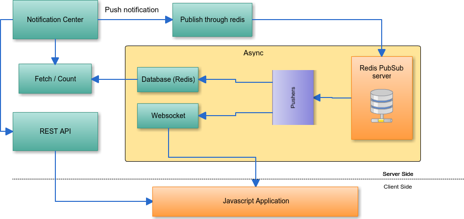

Gos Notification Bundle
=====================

About
--------------
Gos Notification is a Symfony2 Bundle designed to bring real time notification system in your application architecture.
Allow to use multiple pusher like websocket or redis. The notification system is based on pubsub architecture.

How it work
-----------
 

**More documentation will coming soon**